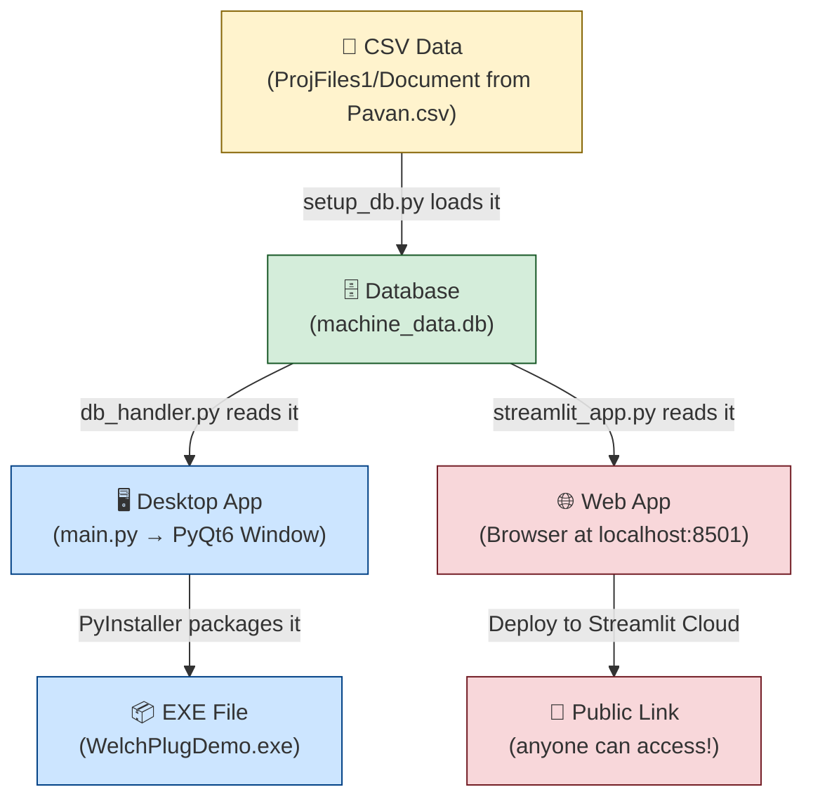

# 🧒 Your Project Guide — Explained Like a Child

---

## 📂 Part 1: What Was Cleaned Up (Deleted)

I removed **5 things** that were unnecessary junk — like cleaning your room before studying!

| Deleted Item | Why It Was Junk |
|---|---|
| `build/` folder | Old leftover files from when the EXE was built. Think of it like wood shavings after making a chair — you keep the chair, not the shavings. Can be regenerated anytime. |
| `dist/` folder | Had a **duplicate copy** of `WelchPlugDemo.exe` (113 MB!). The same EXE was already in `New_Folder/`. No need for two copies. |
| `New_Folder/` | Had the EXE + a duplicate `machine_data.db`. All of this can be regenerated from your source code. No value in keeping it. |
| `WelchPlugDemo.spec` | A recipe file used by PyInstaller to build the EXE. It gets auto-generated every time you build. Keeping it is like keeping an old grocery list — you can make a new one anytime. |
| `__pycache__/` folders | Python's auto-generated cache files. Like browser cache — speeds things up but has zero value to you. Gets recreated automatically. |

> [!TIP]
> **Total space freed:** ~230+ MB of duplicate/junk files! Your project is now lean and clean.

---

## 📂 Part 2: Your Clean Project Structure

Here's what you have now:

```
UI_to_Sql_Project/
├── database/
│   └── db_handler.py        ← The "waiter" who talks to the database
├── ProjFiles1/
│   ├── Document from Pavan.csv    ← Your RAW machine data (the original Excel/CSV)
│   ├── Document from Pavan(1).csv ← Another version of the data
│   ├── data.csv                   ← More data
│   ├── Photo from Pavan.jpg       ← Reference screenshot of the original app
│   ├── Photo from Pavan(1).jpg    ← Another reference screenshot
│   └── project_proposal.md       ← Your project plan / client proposal
├── ui/
│   ├── main_window.py       ← The "house" (main app window with tabs)
│   └── report_screen.py     ← The "room" (the Report Screen inside the house)
├── main.py                  ← The "front door" (starts the desktop EXE app)
├── setup_db.py              ← The "loader" (loads CSV data into the database)
├── streamlit_app.py         ← The "website version" (runs the demo in a browser)
└── machine_data.db          ← The "filing cabinet" (database with all machine data)
```

---

## 📂 Part 3: What Each File Does (Explained Like a Child)

### 🚪 `main.py` — The Front Door
**Analogy:** Imagine your app is a house. `main.py` is the **front door**. When someone double-clicks the EXE, this file opens and says "Welcome! Let me show you the main window."

**What it does:**
- Starts the PyQt6 desktop application
- Creates the main window and shows it on screen
- That's it! It's a very small file — just 14 lines

---

### 📦 `setup_db.py` — The Loader / Delivery Guy
**Analogy:** Imagine you have a truck full of boxes (your CSV data). `setup_db.py` is the **delivery guy** who takes those boxes and neatly arranges them on shelves in a warehouse (the database).

**What it does:**
1. Reads your CSV file (`Document from Pavan.csv`) from the `ProjFiles1/` folder
2. Creates a database file called `machine_data.db`
3. Puts all the CSV rows into a database table called `OP10_WELCH_PLUG_PRESS_1`

**When do you run this?** Only **once** at the beginning, or whenever you have new CSV data to load.

---

### 🌐 `streamlit_app.py` — The Website Version
**Analogy:** This is like a **web version** of your report screen. Instead of installing an app, users open a link in their browser (like opening YouTube) and can search for reports.

**What it does:**
1. Shows a title bar with Model Name, Customer Name, etc.
2. Lets you pick From Date, To Date, Station, and Serial Number
3. Clicks "Search Report" → shows the results in a table
4. Has a "Download CSV" button so you can save the results

**Why it matters:** This is the EASIEST way to give someone a demo — just send them a link!

---

### 🗄️ `database/db_handler.py` — The Waiter
**Analogy:** When you go to a restaurant, you don't go into the kitchen yourself. You tell the **waiter** what you want, and the waiter brings it to you. `db_handler.py` is that waiter.

**What it does:**
- The desktop app (PyQt6) uses this file to talk to the database
- It has two skills:
  - `get_stations()` → "Hey database, what tables (stations) do you have?"
  - `search_report()` → "Hey database, give me records between these dates for this station"

---

### 🏠 `ui/main_window.py` — The House
**Analogy:** This is the **entire house** of your desktop app. It has rooms (tabs) inside it.

**What it does:**
- Shows the big title "WELCH PLUG PRESSING MACHINE DATALOGGING"
- Shows the info bar (Model Name, Customer, Unit, Shift, etc.)
- Has 3 tabs on the left side:
  1. **Overall Status** — A placeholder/mock screen
  2. **Report Screen** — The real working screen (loads `report_screen.py`)
  3. **Station Data Screen** — Another placeholder/mock screen
- Has an Exit button to close the app

---

### 📊 `ui/report_screen.py` — The Room Where Work Happens
**Analogy:** Inside the house, this is the **actual working room** — the room where you search for data and see results.

**What it does:**
- Has date pickers (From, To) to select a date range
- Has a dropdown to select which Station/Machine to query
- Has a text box for serial number (optional filter)
- "Search Report" button → asks the waiter (`db_handler.py`) to fetch data → shows it in a table
- "Save Button" → exports the table data to a CSV file on your computer

---

### 📁 `machine_data.db` — The Filing Cabinet
**Analogy:** This is the **filing cabinet** where all the machine data is stored neatly. When the app needs data, it opens this cabinet and searches through it.

- It's a SQLite database (a single file, no server needed!)
- Contains a table called `OP10_WELCH_PLUG_PRESS_1` with columns like DATE_TIME, SERIAL_NO, and machine readings

---

### 📁 `ProjFiles1/` — Your Reference Folder
This folder has your original materials:

| File | What it is |
|---|---|
| `Document from Pavan.csv` | The main CSV data file used to populate the database |
| `Document from Pavan(1).csv` | Another version of the data |
| `data.csv` | Additional data file |
| `Photo from Pavan.jpg` | Screenshot of the original factory software (for reference) |
| `Photo from Pavan(1).jpg` | Another reference screenshot |
| `project_proposal.md` | Your project plan with client questions, time estimates, and pricing |

---

## 🖥️ Part 4: How to Run the Streamlit Demo (Browser Demo)

### What is Streamlit?
Think of Streamlit as a **magic tool** that turns your Python script into a website — no HTML, no CSS, no JavaScript needed! You write Python, and Streamlit shows it as a beautiful web page.

### Step-by-Step: Run Locally

**Step 1:** Open a terminal/command prompt in your project folder

**Step 2:** Make sure you have the required packages installed:
```bash
pip install streamlit pandas
```

**Step 3:** Run the Streamlit app:
```bash
streamlit run streamlit_app.py
```

**Step 4:** Your browser will automatically open at `http://localhost:8501`

**Step 5:** You'll see the app! Pick dates, select a station, click "Search Report" → see the data!

> [!NOTE]
> The demo reads from `machine_data.db` in the same folder. Make sure you've run `python setup_db.py` first to create the database from your CSV!

---

## 💻 Part 5: How to Create and Use the EXE Demo (Desktop App)

### What is the EXE?
The EXE is a **standalone desktop application**. The user just double-clicks it and the app opens — no Python needed on their computer!

### Step-by-Step: Build the EXE

**Step 1:** Make sure you have PyInstaller and PyQt6 installed:
```bash
pip install pyinstaller PyQt6 pandas
```

**Step 2:** Run this command from your project folder:
```bash
pyinstaller --onefile --windowed --name WelchPlugDemo --add-data "machine_data.db;." main.py
```

Let me explain each flag like a child:
| Flag | What it means |
|---|---|
| `--onefile` | "Pack everything into ONE single EXE file" (easier to share!) |
| `--windowed` | "Don't show the ugly black terminal window" |
| `--name WelchPlugDemo` | "Name the EXE file `WelchPlugDemo.exe`" |
| `--add-data "machine_data.db;."` | "Hey, also put the database file inside the EXE!" |
| `main.py` | "Start from this file" |

**Step 3:** Wait 1-2 minutes. When done, find your EXE in the `dist/` folder:
```
dist/
└── WelchPlugDemo.exe    ← This is your demo! (~113 MB)
```

**Step 4:** To give this to a client:
1. Copy `WelchPlugDemo.exe` to a USB drive or share via Google Drive
2. Also copy `machine_data.db` next to the EXE (in the same folder)
3. The client just double-clicks the EXE → the app opens!

> [!IMPORTANT]
> The EXE needs `machine_data.db` to be in the **same folder** as the EXE file. Without it, the app will open but show no data.

---

## 🌍 Part 6: How to Share Streamlit Demo Online (So Anyone Can Access Via Link)

This is the most exciting part! You can deploy your Streamlit app **for free** so that anyone with the link can use it — like sharing a YouTube video!

### Option A: Streamlit Community Cloud (FREE — Recommended! ⭐)

This is the easiest and best method. Here's the step-by-step:

---

#### Step 1: Push Your Project to GitHub

You need a GitHub account. If you don't have one, create one at [github.com](https://github.com).

```bash
# Inside your project folder, run these one by one:

git init
git add streamlit_app.py setup_db.py machine_data.db database/ ProjFiles1/
git commit -m "Initial commit - Welch Plug Demo"
```

Then create a new repository on GitHub (go to github.com → click "+" → "New Repository" → name it `welch-plug-demo`), and push:

```bash
git remote add origin https://github.com/YOUR_USERNAME/welch-plug-demo.git
git branch -M main
git push -u origin main
```

---

#### Step 2: Add a `requirements.txt` File

Streamlit Cloud needs to know what packages to install. Create a file called `requirements.txt` in your project root:

```
streamlit
pandas
```

Add and push it:
```bash
git add requirements.txt
git commit -m "Add requirements.txt"
git push
```

---

#### Step 3: Deploy on Streamlit Community Cloud

1. Go to [share.streamlit.io](https://share.streamlit.io)
2. Click **"New app"**
3. Connect your GitHub account (if not already connected)
4. Select your repository: `welch-plug-demo`
5. Select the branch: `main`
6. Set the main file path: `streamlit_app.py`
7. Click **"Deploy!"** 🚀

---

#### Step 4: Wait for Deployment (2-5 minutes)

Streamlit will:
1. Read your code from GitHub
2. Install the packages from `requirements.txt`
3. Run `streamlit_app.py`
4. Give you a **public URL** like:

```
https://YOUR_USERNAME-welch-plug-demo-streamlit-app-xxxxxx.streamlit.app
```

---

#### Step 5: Share the Link! 🎉

Copy that URL and send it to anyone! They can:
- ✅ Open it in any browser (phone, laptop, tablet)
- ✅ Use all the filters (date, station, serial number)
- ✅ Search and view reports
- ✅ Download CSV exports
- ❌ They do NOT need to install Python or anything else!

> [!IMPORTANT]
> **About the Database:** Since `machine_data.db` is included in your GitHub repo, it will work on Streamlit Cloud. But remember — the data is **read-only** on the cloud. If you update your CSV, you need to:
> 1. Run `python setup_db.py` locally to regenerate `machine_data.db`
> 2. Push the updated file to GitHub
> 3. Reboot the Streamlit Cloud app

---

### Option B: Ngrok (Quick & Temporary — for live demos)

If you just want to share your **locally running** Streamlit app for a quick demo (like a 1-hour meeting), use Ngrok:

**Step 1:** Install Ngrok
```bash
pip install pyngrok
```

**Step 2:** Run Streamlit locally
```bash
streamlit run streamlit_app.py
```

**Step 3:** In a new terminal, run:
```bash
ngrok http 8501
```

**Step 4:** Ngrok gives you a temporary public URL like:
```
https://abc123.ngrok-free.app
```

Share this link! But note:
- ⚠️ The link **dies** when you close your terminal
- ⚠️ Your computer must stay ON and connected to internet
- ✅ Great for quick live demos to clients

---

## 🗺️ Quick Summary: Which Demo Method to Use?

| Method | Best For | Cost | Link Lifetime | Setup Difficulty |
|---|---|---|---|---|
| **Streamlit (Local)** | Testing on your own computer | Free | Only while running | ⭐ Very Easy |
| **EXE (Desktop)** | Giving a file to a client on USB/email | Free | Forever (it's a file) | ⭐⭐ Easy |
| **Streamlit Cloud** | Sharing a link anyone can access | Free | Permanent (until you delete) | ⭐⭐ Easy |
| **Ngrok** | Quick temporary demo during a meeting | Free (limited) | Until you close terminal | ⭐⭐ Easy |

---

## 🔁 Visual Flow: How Everything Connects


